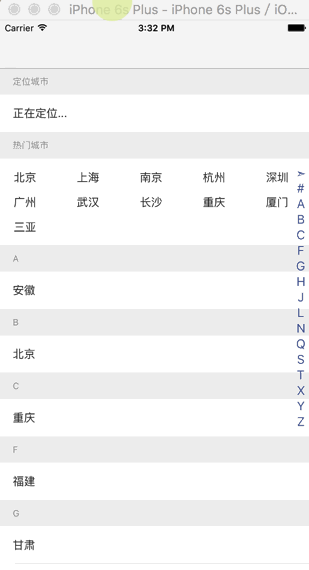

#### 实现动画效果的UITableView索引

#####使用示例:
* #import "MJNIndexView.h"
* 遵守协议 MJNIndexViewDataSource

#####初始化:
```
/**
 *  初始化MJNIndexView
 */
- (void)initialiseMJNIndexView{
    self.indexView = [[MJNIndexView alloc]initWithFrame:self.view.bounds];
    self.indexView.dataSource = self;
    self.indexView.fontColor = HEXCOLOR(0x52669b);
    self.indexView.font = HCFontWithPixel(30);
    self.indexView.selectedItemFont = HCBoldFontWithPixel(60);
    self.indexView.itemsAligment = NSTextAlignmentCenter;
    self.indexView.curtainFade = 0.0;
    self.indexView.rightMargin = ALD(10);
    self.indexView.maxItemDeflection = 75;
    self.indexView.rangeOfDeflection = 3;
    self.indexView.darkening = NO;
    [self.view addSubview:self.indexView];
}


```
#####代理方法:
```
#pragma mark - <MJNIndexViewDataSource>

- (NSArray *)sectionIndexTitlesForMJNIndexView:(MJNIndexView *)indexView
{
    return self.indexArray;
}

- (void)sectionForSectionMJNIndexTitle:(NSString *)title atIndex:(NSInteger)index;
{
    [self.provinceTableView scrollToRowAtIndexPath:[NSIndexPath indexPathForItem:0
                                                                    inSection:index] atScrollPosition: UITableViewScrollPositionTop     animated:YES];
}

```


效果演示:



